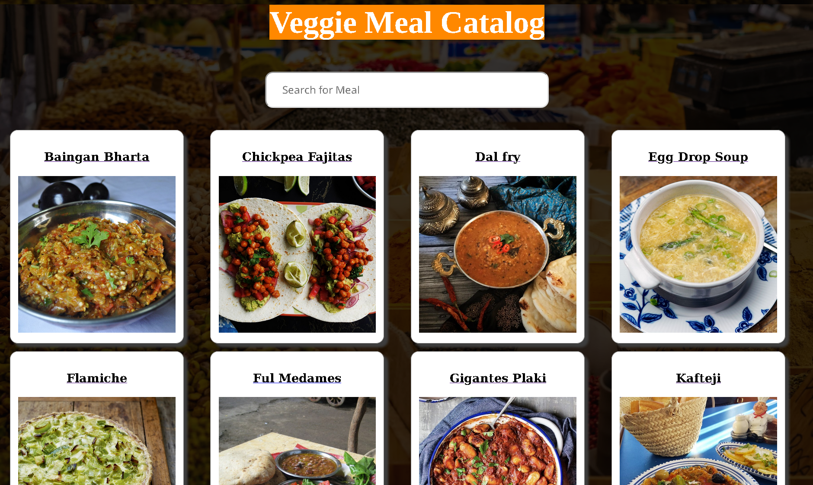

# React Meal Catalog App

React Meal Catalog App uses themealdb.com API to fetch data for vegetarian meals. User can filter the displayed meals searching by meal's name.

## Built With

- React
- Redux
- NPM
- HTML/CSS

## How to run this project on your local machine
### Steps to follow
1. Clone the repository using `git@github.com:zilton7/react-meal-catalog.git`
2. Navigate to the folder by inputting `cd react-meal-catalog` in your terminal.
3. Run `npm i` to install the dependencies.
4. Run `npm start` to start the app on local server.
5. Point your browser to `http://localhost:3000/` to load the app.

## Live Demo

[Live Link](https://zil-react-catalog.herokuapp.com/)

## Testing

Run all the tests using command:
`npm test`
## Author

**ZIL NORVILIS**
- Github: 
- Linkedin: 
- Twitter: 

## Show your support

Give a ⭐️ if you like this project!